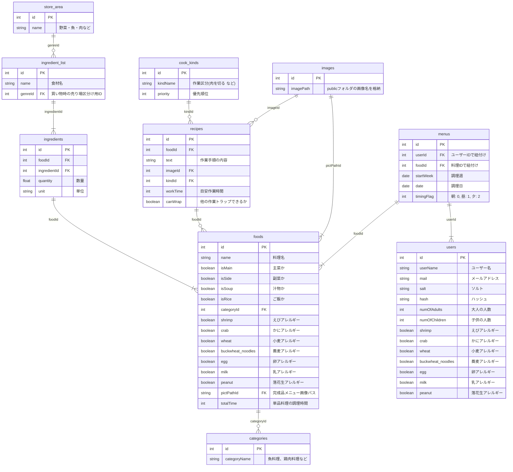

# アプリ名：🐻クックま🐻

BTC5 チーム名：ウィッシュ

PO：まあや、TL：shun、Amazingdev:たなちゅー、Amazingdev：ぶっちー


# How to use 
アプリの動きは写真左から右の流れ

1.ログイン画面でユーザー名、パスワードを入力しログイン  
  　ユーザー名:あなたの設定、 passwword:あなたの設定
  
2.アカウントなければ新規登録で必要事項入力しログイン  
  　ユーザー名:あなたの設定、　メールアドレス:あなたの設定、　 passwword:あなたの設定
  　大人、子供の人数、アレルギーを登録する
  
3.自動生成された献立(5日分)を確認

4.献立変更ボタンで献立を選択し、献立(5日分)を決める

５.買い物リストで献立(5日分)の食材を購入する

6.料理ボタンを押すと当日の献立の料理工程を最適化した手順で料理をサポート

　
　
　


# Index

- [About](#about)
- [Development](#development)
- [How to Deploy](#how-to-Deploy)
- [Future plans](#future-plans)


# About
毎日忙しいけど愛する人を手料理で喜ばせたい...    
限られた時間で複数品の料理をマルチタスクで実施する為、自分の時間がなくゆっくり休めない。  
<br>
そんな方へ私達から解決手段を提供します。    
私たちのサービスを使用する事で、あなたとパートナーは、毎回新鮮で素晴らしい体験が出来るでしょう  


I am busy every day but want to please my loved ones with home-cooked food...    
You multitask and cook multiple dishes in a limited amount of time, leaving you no time for yourself and no time for rest. 
<br>
We offer you a solution.   
By using our service, you and your partner will have a fresh and wonderful experience every time!  

# Development
Follow this guide to set up your environment etc.
### < Database >  
This project assumes a Postgres database, naturally, this is not included in the package.json file, so must be installed separately.

Create a database called `las_damas_primero`.

### < Rakuten Developers >
このプロダクトを試用するのは楽天デベロッパーズのアプリIDが必要だよ

アプリID作成用URL　：　https://webservice.rakuten.co.jp/app/create
### <.env config >
このプロダクトは.envファイルを使用して環境変数を定義しているよ。

1.Go into the repository

`$ cd las-damas-primero/server`

2.Create .env file

`$ touch .env`
3.環境変数を記述しよう
```
DB_USER="hoge" <= Your command line username
APP_ID="fuga" <= Your command line あなたの楽天APP_ID
DB_PASSWORD="hogehoge" <= Your command line password
DB_NAME=las_damas_primero
NODE_ENV=development
```
### < Downloading and installing steps >  
1.Clone this repository

`$ git clone https://github.com/ryozo7/las-damas-primero.git`  

2.Go into the repository

`$ cd las-damas-primero/server`

3.Install dependencies

`$ npm install`

4.Create database, Run migrations and set up the database

`$ npm run migrate`

5.Run the app

`npm run dev`

# How to Deploy
レンダーの場合を説明するよ
### < 1.Renderでデータベースを作成しよう >
```
  1.ヘッダーに表示されている「New +」のボタンをクリック  
  2.「PostgreSQL」を選択  
  3.作成するデータベースの名称を記入します
  4.入力できたら「Create Database」をクリック  
  5.データベースの作成が始まり、「Status」に「Creating」と表示されます  
  6.Statusが「Available」に変わったらデータベースの作成は完了  
  7.画面を下にスクロールし「Internal Database URL」をコピー
```
### < 2.Renderでアプリを新規作成 >
```
  1.ヘッダーにある「New +」のボタンをクリック  
  2.「Web　service」をクリック  
  3.「Build and deploy from a Git repository」をチェック
  4.「Next」をクリック
  5.GitHubの「Configure account」をクリック
  6.クローンしたリポジトリを保存しているアカウントの「Configure」をクリック
  7.passwordを入力しlogin
  8.「Only select repositories」をチェックし、「Select repositories」をクリック
  9.クローンしたリポジトリーをクリック
  10.renderの画面に遷移し、クローンしたリポジトリが表示されるので、「Connect」のボタンをクリック
  11.Name欄にアプリケーションの名称を入力
  12.アプリのデプロイや起動時のコマンドを入力します
    Branch => main
    Root Directory => ./server
    Build =>　npm run build
    Start =>　　npm start
  13.画面をスクロールすると、「Advanced」という文字が書かれているのでクリック
  14.環境変数を設定します。
      key         :   value
    APP_ID        : あなたの楽天APP_ID
    DATABASE_URL  : 1.Renderでデータベースを作成しよう_7.でコピーしたURL
    NODE_ENV      : production
    VITE_NODE_ENV : production
  15.ターミナルが表示され、デプロイ作業が開始されます
    デプロイが完了すると、緑色のアイコンで「Live」(画面上部)と表示されたらデプロイ完了
    画面上部のURLからアプリに接続し、正常に動かすことができるか確認しよう！
```
# Future plans
- 絞り込み地域の細分化  
- レビュー点数しか見ていないので、レビュー数と相関した、より信頼性の高い評価ソート
- 宿泊したことあるホテルリストの追加


ライセンス情報？  


# こんにちは dev ブランチ

ルート直下で、`npm run setup`を起動すると、

- ルート直下
- client フォルダ内
- sever フォルダ内

で、

`npm install`コマンドが実行されて初期セットアップできます。

## ER 図


